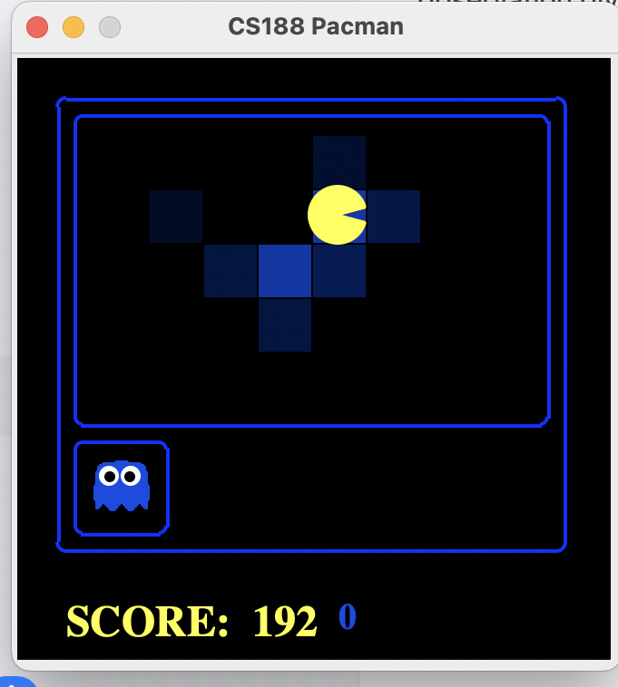

# Pacman Ghostbusters AI

This project was completed as part of **UC Berkeley CS 188: Introduction to Artificial Intelligence**.

The goal is to track invisible ghosts in the Pacman environment using noisy sensor observations. Instead of knowing the exact ghost location, Pacman maintains a probability distribution over possible positions and continuously updates that belief as new evidence arrives.

## Demo



The shaded regions represent Pacman's belief about where a hidden ghost is likely to be.

---

## What I Implemented

### Bayes Network Construction

I constructed the probabilistic model connecting:

- Pacman's position
- Ghost positions
- Noisy distance observations

I defined the network structure, variable domains, and dependencies between hidden states and observations.

### Variable Elimination

I implemented inference by variable elimination rather than computing the entire joint distribution at once.

The algorithm:

- Specializes factors using observed evidence
- Joins factors containing the current hidden variable
- Marginalizes that variable
- Repeats according to the elimination order
- Joins the remaining factors and normalizes the final distribution

This reduced probabilistic inference into a sequence of local factor operations.

### Probability Distribution Utilities

I implemented utilities for discrete probability distributions, including:

- Distribution normalization
- Weighted random sampling
- Cumulative probability sampling
- Most-likely-state extraction

These utilities were later reused by both exact inference and particle filtering.

### Observation Model

I implemented the observation likelihood

`P(noisy distance | Pacman position, ghost position)`

using Manhattan distance and the provided noisy sensor model.

I also handled the special case where a captured ghost is placed in jail and produces no distance observation.

### Exact Inference

I implemented the forward belief update for tracking a hidden ghost.

For each possible ghost position, the posterior belief is updated using:

`new belief ∝ previous belief × observation likelihood`

The resulting distribution is then normalized.

I also implemented the time-elapse prediction step by propagating probability mass through the ghost transition model:

`P(X_t+1) = Σ P(X_t) P(X_t+1 | X_t)`

This allowed Pacman to combine both sensor evidence and knowledge of how ghosts move.

### Particle Filtering

I implemented approximate inference using a particle filter.

The particle filter includes:

- Uniform particle initialization over legal positions
- Conversion of particles into belief distributions
- Observation-based particle weighting
- Weighted resampling
- Recovery when all particle weights become zero
- State transition sampling as time advances

This provides an approximate alternative to exact inference when maintaining the full probability distribution becomes expensive.

### Belief-Based Decision Making

The resulting belief distributions allow Pacman to reason about hidden ghost locations rather than relying on exact state information.

The agent can use the most likely ghost positions to choose actions and move toward predicted targets.

---

## Algorithm Highlights

The following pseudocode summarizes the main ideas I implemented.  
It is intentionally simplified and does not reproduce the original CS 188 solution code.

```python
# Variable Elimination

factors = specialize_factors(evidence)

for hidden_variable in elimination_order:

    relevant, remaining = split_factors(
        factors,
        hidden_variable
    )

    joined = join(relevant)

    if joined.has_other_unconditioned_variables():
        reduced = marginalize(
            joined,
            hidden_variable
        )

        factors = remaining + [reduced]
    else:
        factors = remaining

result = normalize(join(factors))
```

```python
# Exact Bayesian Belief Update

for ghost_position in possible_positions:

    prior = belief[ghost_position]

    likelihood = observation_model(
        noisy_distance,
        pacman_position,
        ghost_position
    )

    posterior[ghost_position] = (
        prior * likelihood
    )

posterior.normalize()
```

```python
# Time-Elapse Prediction

next_belief = empty_distribution()

for old_position in possible_positions:

    transition = transition_model(
        old_position
    )

    for new_position, probability in transition:

        next_belief[new_position] += (
            belief[old_position]
            * probability
        )

belief = next_belief
```

```python
# Particle Filter Observation Update

weights = empty_distribution()

for particle in particles:

    weights[particle] += observation_likelihood(
        observation,
        pacman_position,
        particle
    )

if weights.total() == 0:

    particles = initialize_uniformly()

else:

    particles = [
        weighted_sample(weights)
        for _ in range(num_particles)
    ]
```

```python
# Particle Filter Time Update

new_particles = []

for particle in particles:

    transition_distribution = transition_model(
        particle
    )

    next_position = weighted_sample(
        transition_distribution
    )

    new_particles.append(next_position)

particles = new_particles
```

---

## Technologies & Concepts

- Python
- Bayes Networks
- Conditional Probability Tables
- Variable Elimination
- Marginalization
- Hidden Markov Models
- Bayesian Belief Updates
- Exact Inference
- Particle Filtering
- Weighted Sampling
- Probabilistic State Estimation
- Belief-Based Decision Making

---

## What I Learned

This project helped me understand probabilistic inference beyond the equations.

The most useful part for me was seeing how a belief distribution changes over time: sensor observations make some states more likely, while the transition model spreads probability according to how the ghost can move.

Implementing both exact inference and particle filtering also helped me see the tradeoff between maintaining a complete probability distribution and approximating that distribution using samples.

---

## Course Context

This project was completed as part of **UC Berkeley CS 188: Introduction to Artificial Intelligence**.

The Pacman framework, starter code, and supporting infrastructure were provided by UC Berkeley. I implemented selected probabilistic inference and agent components within the provided framework.

To respect the course project's academic-use license, this repository documents my work using project descriptions and simplified pseudocode rather than publishing the original solution code.

